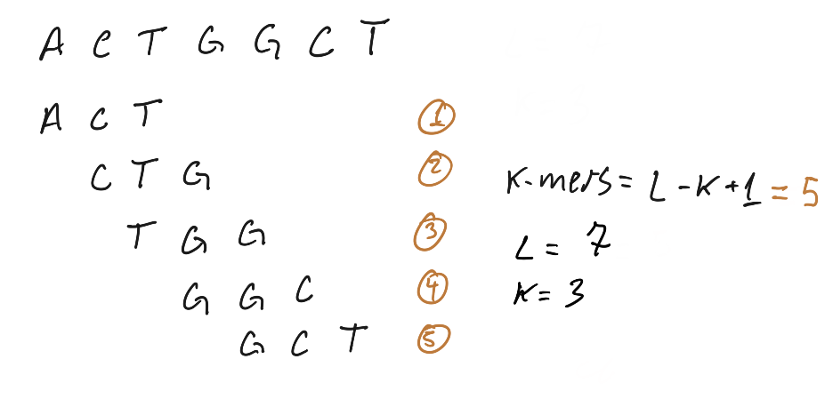
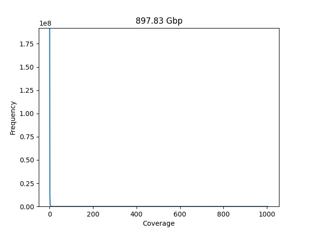
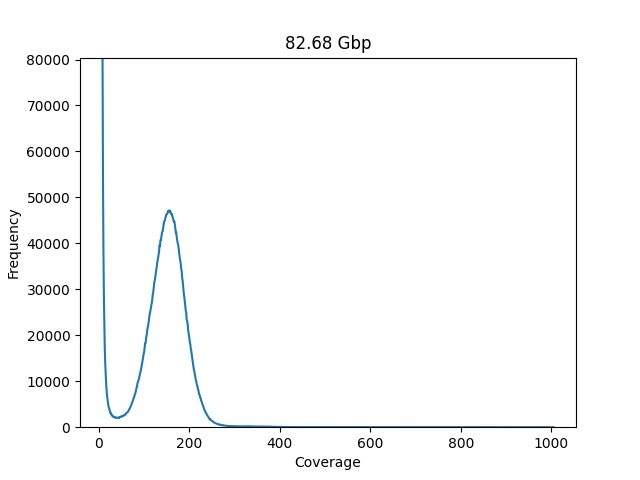
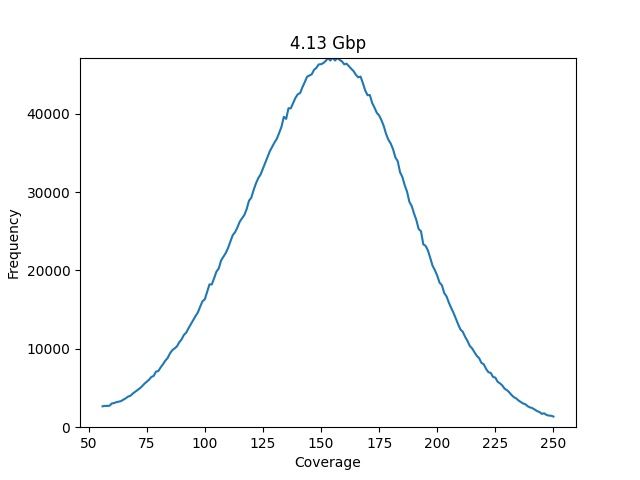

---
[meta]
title = "K-mer analysis with python"
date = 2021-02-10
tags = ["bioinformatics", "kmer", "python"]
description = "Short article"
---

K-mers are n-gram applied to computational genomics, the basic idea is to use 
subsequences of DNA to answer biological questions, when dealing with software 
that perform k-mer analysis we often take it in the context of all possible 
subsequences of length K, it’s one of those things that is easily grasped by a 
ugly hand draw:



Here is a simple implementation of a k-mer count function in python, this require
a lot of memory to run and can not be used in real life with NGS data (unless you 
have tons of memory to spare), but works fine for understanding the idea of k-mer
counting.
 
```python
def count_kmers(sequence, k_size):
    data = {}
    size = len(sequence)
    for i in range(size - k_size + 1):
        kmer = sequence[i: i + k_size]
        try:
            data[kmer] += 1
        except KeyError:
            data[kmer] = 1
    return data

count_kmers("CTGACTGACTGACTGTA", 3)
```
**output:**

```python
{'CTG': 4, 'TGA': 3, 'GAC': 3, 'ACT': 3, 'TGT': 1, 'GTA': 1}
```

**k-mer analysis has many uses in bioinformatics, to quote a few:**

 - genome assembly ( spades )
 - taxonomy classification ( kraken )
 - genome comparison (minhash)
 - genome analysis ( jellyfish + genomescope )
 - sequence data compression 

With this broader usage you may wonder what make k-mers so interesting? The 
short answer is that k-mers are computationally cheap to produce, sort, count 
and compare, while aligners for example, are expensive and need to deal with all 
sort of ambiguities like mismatches and gaps.

**But how can we extract useful information from such small pieces of DNA?** 

The size required for a k-mer will change broadly between applications, for
taxonomy classification a large `k` may carry information at species level, while 
a small `k` will give information at a higher rank, Kraken 2 is using k=35 as 
default.
 
More often the information will be encoded in the k-mer distribution instead of 
k-mer size. One classical example is the GC content (it’s a distribution of k-mers 
with k=1 ), mammals and birds are supposed to have a higher ratio of Gs and Cs 
to As and Ts, it’s a pattern, not always hold true but it’s there.

Of course, even when working with k-mer distributions the value of K will impact
in the kind and quality of information you will be able to extract. A small K will 
have less information as it just repeats everywhere in your sequencing data a bigger
K will be more specific, but if too big, will be hard to define useful patterns due it 
uniqueness.

With the python function from before we just counted how many times each k-mer 
appears in our sample (the individual k-mer coverage), the next thing we need 
to do is generate the frequency of the coverage values:

```python
def calculate_coverage_frequence(kmer_dataset):
    _coverage_freq = {}
    for coverage in kmer_dataset.values():
        try:
            _coverage_freq[coverage] += 1
        except KeyError
            _coverage_freq[coverage] = 1
    return _coverage_freq

calculate_coverage_frequence(
    {'CTG': 4, 'TGA': 3, 'GAC': 3, 'ACT': 3, 'TGT': 1, 'GTA': 1}
)
```

This time we get a dictionary that count how many times k-mers with coverage X 
appears in our sample:

```python
{4: 1, 3: 3, 1: 2}
```

Plotting this distribution in a histogram is how we are going to run our first 
k-mer analysis.

## Dataset required for this analysis

In this first analysis we are going to estimate the genome size of a Mycobacterium 
tuberculosis using a whole genome sequencing data generated from Illumina, you can 
download the reads [here](http://ftp.sra.ebi.ac.uk/vol1/fastq/SRR786/SRR786188/SRR786188_1.fastq.gz) 
and [here](http://ftp.sra.ebi.ac.uk/vol1/fastq/SRR786/SRR786188/SRR786188_2.fastq.gz) 
the link for the run is https://www.ebi.ac.uk/ena/browser/view/SRR786188.

Googling for the genome size of Mycobacterium tuberculosis shows that in general 
this bacteria has a lenght of 4.4Mbp, so if we get a similar number this means 
that this read data is of good quality and may assembly into a full genome of 
Mycobacterium.

## Step by step guide

The first step is to generate the k-mer count, we are going to use jellyfish for 
this task. If you like me are running Ubuntu you can easily install this tool by 
typing:

    apt install jellyfish

Make sure to decompress te read files you downloaded from EBI, sadly Jellyfish
do not accept compressed read files:

    gzip -d SRR786188_1.fastq.gz && gzip -d SRR786188_2.fastq.gz

Generate the k-mer count:
    
    jellyfish count -C -m 21 -s 1G -o output.jf SRR786188_1.fastq SRR786188_2.fastq

Produce the histogram data containing the frequency of kmers coverage:

    jellyfish histo -o output.histo output.jf

Next we need to load this data and plot it, here is the code: 

```python
import matplotlib.pyplot as plt

with open("output.histo") as fh:
    data = fh.readlines()

dataset = [entry.replace("\n", "") for entry in data]
dataset = [entry.split(" ") for entry in dataset]


def plot_coverage_chart(dataset, min_coverage=0, max_coverage=1000):
    coverage = [int(entry[0]) for entry in dataset][min_coverage:max_coverage]
    frequency = [int(entry[1]) for entry in dataset][min_coverage:max_coverage]
    higher_frequency = max(frequency)
    average_cov = coverage[frequency.index(higher_frequency)]

    plt.plot(coverage, frequency)
    plt.ylabel('Frequency')
    plt.xlabel('Coverage')
    plt.ylim(0, higher_frequency)
    plt.show()

    total_number_of_kmers = sum([c*f for c, f in zip(coverage, frequency)])
    print(int(total_number_of_kmers/average_cov))

plot_coverage_chart(dataset=dataset)
```


The first chart is not very easy to read, the first values for coverage
have a very high frequency value, and is dominating the visualization,
the estimated genome size also seems "a little of" 897 Gbp.

Lets increase the resolution of our port by trimming on the left side,
start considering coverage at 7:

```python
plot_coverage_chart(dataset=dataset, min_coverage=7)
```


This plot is a lot easier for a human to read, and the genome size also lowered 
to 82 Gbp, we can brake it down in three to better understand what is happening:

The red highlight contains the majority of kmers, those are rare k-mers with a 
low frequency or sequencing errors resulting in unique k-mers, the green highlight
represents the backbone of our genome, it looks like a Poisson distribution and 
that is a great indicator about the health of our data. The third highlight is 
the repeat tail, the collection of kmers that have high coverage and low frequency, 
the repeated part of our target genome.

To estimate the genome size we need to make the plot look more with a Poisson 
distribution, we can do that manually trimming on the sides to generate only the 
green portion of the plot:

```python
plot_coverage_chart(dataset=dataset, min_coverage=55, max_coverage=250)
```



This time we get something that looks like a Poisson distribution, and our genome 
estimation get a lot closer to the expected value of 4.12 Mbp.
